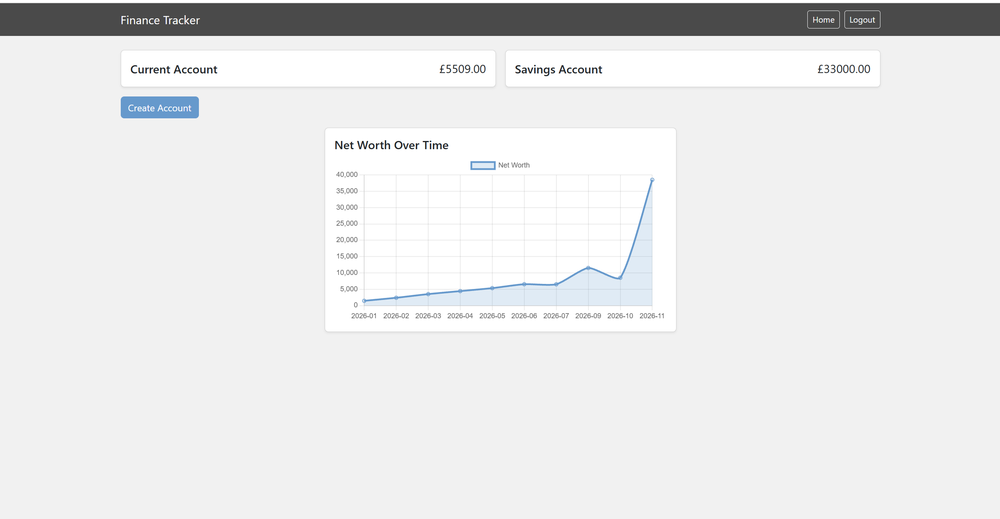
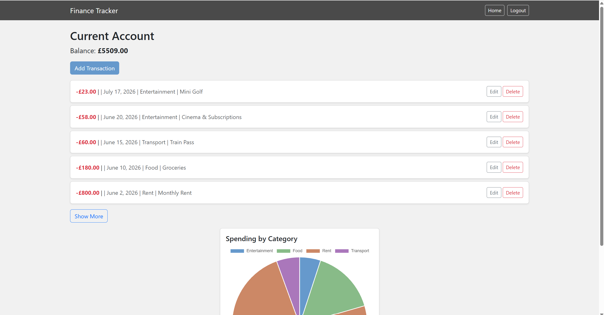

# FinanceTracker

A personal finance tracker that can monitor spending and help establish habits and trends.

Built as a portfolio project to practice full-stack development with Django — covering authentication, relational data modelling, CRUD workflows, and data visualization.




## Features

- **User authentication** — signup, login, logout, with all data scoped to the logged-in user
- **Accounts** — create multiple accounts (e.g. Current, Savings), each with a live-calculated balance
- **Categories** — private, user-owned categories for organizing transactions
- **Transactions** — full CRUD (create, edit, delete) with amount, date, category, income/expense flag, and description
- **Spending by category chart** — a pie chart on each account page, breaking down expenses by category
- **Net worth over time chart** — a line chart on the homepage, showing cumulative net worth trending month over month
- **Responsive, styled UI** — built with Bootstrap 5, custom color scheme and card-based layouts

## Tech Stack

- **Backend:** Python, Django
- **Frontend:** HTML, CSS (Bootstrap 5), JavaScript (Chart.js)
- **Database:** SQLite (development)
- **Testing:** Django's built-in test framework

## Setup

1. Clone the repository:
   ```bash
   git clone https://github.com/michaelb0506-dev/FinanceTracker.git
   cd FinanceTracker
   ```

2. Create and activate a virtual environment:
   ```bash
   python -m venv venv
   source venv/bin/activate  # On Windows: venv\Scripts\activate
   ```

3. Install dependencies:
   ```bash
   pip install -r requirements.txt
   ```

4. Apply migrations:
   ```bash
   python manage.py migrate
   ```

5. (Optional) Populate with sample data:
   ```bash
   python populate.py
   ```
   This creates a test user (`testuser` / `testpassword`) with sample accounts, categories, and several months of transactions.

6. Run the development server:
   ```bash
   python manage.py runserver
   ```

7. Visit `http://127.0.0.1:8000` in your browser.

## Running Tests

```bash
python manage.py test
```

## What I Learned

This was my first time building a full Django project — models, forms, views, templates, and static files all together. A few things stood out:

- How `ModelForm` auto-generates form fields and validation from a model, so I didn't have to write and validate each input by hand — and how to customize it further (e.g. filtering a dropdown's choices based on the logged-in user).
- Designing models with future features in mind — e.g. making `Category` its own model linked to `User`, so it could later become private per-user without a rewrite.
- Scoping every query to the logged-in user, not just in views but in forms too.
- Integrating a JS charting library (Chart.js) into Django by passing data from the backend as JSON, rather than hardcoding it in JavaScript.

## Future Improvements

- Deploy to a live host
- Add filtering/search on the transaction list
- Support recurring transactions
- Export data to CSV

---
Built by Michael Bennion as a personal portfolio project.